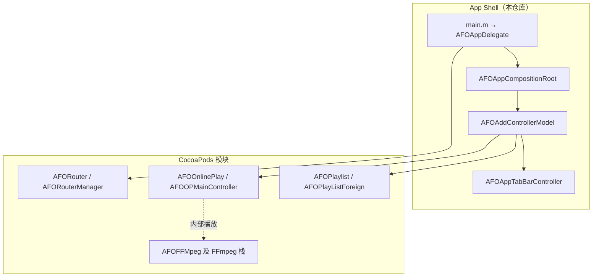

# AFOPlayer

通过 FFmpeg 解码视频的 **iOS 播放器**，工程采用 **CocoaPods 组件化**。

| 链接 | 说明 |
|------|------|
| **仓库** | [github.com/PangDu/AFOPlayer](https://github.com/PangDu/AFOPlayer) |
| **项目结构** | [docs/项目结构.md](docs/项目结构.md)（目录树） |
| **架构报告** | 见下文（与 [docs/架构报告.md](docs/架构报告.md) 内容一致，可任一处修改后同步另一处） |

---

# AFOPlayer 架构报告

**范围：** App Shell（`AFOPlayer/AFOPlayer/AFOPlayer/`）与各 **AFO\*** CocoaPods 模块的边界、协作契约与运维风险。解码与路由等实现细节以 Pod 为准，本文依据宿主集成与 `Podfile` 归纳。

**更新日期：** 2026-04

---

## 第一项：整体架构形态（薄壳宿主 + 模块化 Pod）

### 1.1 职责划分

| 层次 | 职责 | 典型位置 |
|------|------|----------|
| **宿主（Shell）** | `UIApplication` 入口、根 `UIWindow`、根 `UITabBarController` 装配、跨模块横切（旋转策略转发、Push 时 TabBar 隐藏、在线 URL 记忆） | `main.m`、`AFOAppDelegate*`、`AFOAppCompositionRoot`、`AFOAddControllerModel`、`AFOAppTabBarController*`、`AFOOPMainController+AFOAppURLCache` |
| **功能 Pod** | 播放列表 UI、在线播放 UI、FFmpeg 解码链路、路由、存储、通用 UI 与业务基础库 | `AFOPlaylist`、`AFOOnlinePlay`、`AFOFFMpeg`、`AFORouter`、`AFOSQLite` 等 |

**依赖方向：** 宿主 **依赖** Pod 对外公开的头文件与「工厂类」（如 `AFOPlayListForeign`、`AFOOPMainController`）；Pod **不反向依赖** 宿主 target，从而保持模块可独立发版。

### 1.2 模块边界原则

- **UI 主流程**（列表 Tab、在线 Tab）由 Pod 实现；宿主只做 **类名字符串驱动** 的装配。
- **解码与渲染** 集中在 `AFOFFMpeg` 及其传递依赖；宿主不直接链接 FFmpeg 头文件（由 Pod 与 `Podfile` `post_install` 统一配置链接参数）。
- **深链 / URL 回调** 尽量通过 `AFORouterManager` + `AFODelegateForeign` 扩展，避免在宿主堆叠硬编码跳转。

### 1.3 结构示意图



### 1.4 窗口与资源（宿主内）

| 类型 | 位置 / 类 | 说明 |
|------|-----------|------|
| 主窗口 | `AppDelegate` 中懒加载的 `AFOAppWindow`；`AFOAppDelegate` **继承** `AppDelegate` 以复用该 `window` 访问器 | `AFOAppWindow` 当前为空子类，可扩展统一触摸/日志 |
| 预编译头 | `resources/AFOPlayer.pch` | 全局头与宏 |
| Metal | `resources/AFOMetalShaders.metal` | 着色器资源 |
| 打包资源 | `resources/AFOPlayer.bundle` | 非代码资源 |
| 工程配置 | `resources/Info.plist`、`Assets.xcassets` | Icon、启动屏等 |

---

## 第二项：启动链路与委托分发

### 2.1 调用顺序（冷启动）

1. **`main`**：`UIApplicationMain` 指定 **`AFOAppDelegate`** 为应用委托类。
2. **`application:didFinishLaunchingWithOptions:`**（`AFOAppDelegate`）  
   - 将 **`self.tabBarController`** 设为 **`self.window.rootViewController`**（`tabBarController` 懒加载时通过 `AFOAppCompositionRoot` 创建完整 Tab）。  
   - 调用 **`[[AFODelegateForeign shareInstance] addImplementationQueueTarget:(id)[AFORouterManager shareInstance]]`**，把路由单例挂入 **多委托实现队列**（与 `AFODelegateExtension` 协同）。  
   - **`[self.window makeKeyAndVisible]`** 后，将 **`didFinishLaunching`** 转交给 **`AFODelegateForeign`** 统一转发（路由与其它注册方有机会在此阶段继续初始化）。

3. **`AFOAppCompositionRoot +makeRootTabBarController`**：  
   - `[[AFOAppTabBarController alloc] init]`  
   - `[[AFOAddControllerModel alloc] init]` → **`controllerInitialization:`** 填充 `viewControllers`。

4. **`openURL:options:`**（`AFOAppDelegate`）：同样交给 **`AFODelegateForeign`**，由队列中的 `AFORouterManager` 等按序处理，宿主 **不在此写死** 具体业务 URL 解析。

### 2.2 关键代码参照

`AFOAppDelegate` 中启动与委托链（节选）：

```objc
// AFOPlayer/AFOPlayer/AFOAppDelegate.m
- (BOOL)application:(UIApplication *)application didFinishLaunchingWithOptions:(NSDictionary *)launchOptions {
    self.window.rootViewController = self.tabBarController;
    [[AFODelegateForeign shareInstance] addImplementationQueueTarget:(id<UIApplicationDelegate>)[AFORouterManager shareInstance]];
    [self.window makeKeyAndVisible];
    return [[AFODelegateForeign shareInstance] application:application didFinishLaunchingWithOptions:launchOptions];
}

- (BOOL)application:(UIApplication *)application openURL:(NSURL *)url options:(NSDictionary<UIApplicationOpenURLOptionsKey,id> *)options {
    return [[AFODelegateForeign shareInstance] application:application openURL:url options:options];
}
```

`AFOAppCompositionRoot` 仅负责「创建 TabBar + 触发装配」：

```objc
// AFOPlayer/AFOPlayer/AFOPlayer/models/AFOAppCompositionRoot.m
+ (AFOAppTabBarController *)makeRootTabBarController {
    AFOAppTabBarController *tabBarController = [[AFOAppTabBarController alloc] init];
    AFOAddControllerModel *addModel = [[AFOAddControllerModel alloc] init];
    [addModel controllerInitialization:tabBarController];
    return tabBarController;
}
```

### 2.3 与 `AppDelegate`（模板类）的关系

- **`AFOAppDelegate` 继承 `AppDelegate`**（见 `AFOAppDelegate.h`），因此 **懒加载 `window`、竖屏掩码** 等保留在父类 `AppDelegate` 的分类/实现中。
- `controllers/AppDelegate.m` **不是** `UIApplicationMain` 的 principal class；新生命周期逻辑应落在 **`AFOAppDelegate`**，避免双入口认知混乱。

---

## 第三项：Tab 插件式装配与 `returnController` 契约

### 3.1 装配算法

`AFOAddControllerModel` 对 **`controllerArray`** 中每个 **类名字符串** 执行：

1. `NSClassFromString` → 得到 `Class`。  
2. `[[cls alloc] init]` 得工厂实例（通常为各 Pod 暴露的 **Foreign / 门面**）。  
3. 若实例响应 **`@selector(returnController)`**，则 `performSelector` 取返回值；若为 `UIViewController` 子类，则加入 Tab 的 `viewControllers` 数组。  
4. **未响应或返回值非法** → **静默跳过**（该 Tab 不会出现，无断言）。

### 3.2 当前 Tab 列表

```objc
// AFOPlayer/AFOPlayer/AFOPlayer/models/AFOAddControllerModel.m（逻辑摘录）
_controllerArray = @[
    NSStringFromClass([AFOPlayListForeign class]),  // AFOPlaylist
    NSStringFromClass([AFOOPMainController class]) // AFOOnlinePlay
];
```

- **播放列表 Tab** 必须经过 **`AFOPlayListForeign`**（注释说明：`AFOPLMainController` 无 `-returnController` 会被跳过）。  
- **在线播放 Tab** 直接使用 **`AFOOPMainController`** 作为工厂（该类需对外提供根导航结构）。

### 3.3 扩展新 Tab 的检查清单

| 步骤 | 说明 |
|------|------|
| 在对应 Pod 提供（或已有）门面类 | 实现 **`- (UIViewController *)returnController`**（或运行时等效），返回带导航栈的根界面 |
| 将门面类加入 `controllerArray` | 使用 `NSStringFromClass([YourForeign class])`，保证 **链接** 后类名在运行时可见 |
| 验证 | 启动后应看到新 Tab；若未出现，优先断点 `rootViewControllerFromTabFactory:` 查 `respondsToSelector:` / 返回值类型 |

### 3.4 契约小结

- **约定优于配置**：宿主 **不 import** 各 Tab 内部 VC 层次，只依赖 **极少数 Foreign 类**。  
- **失败静默**：集成错误表现为 **少一个 Tab**，需在交付前覆盖 smoke test。

---

## 第四项：宿主侧横切能力（导航、旋转、URL 缓存）

### 4.1 导航 Push 与 TabBar 隐藏（Method Swizzle）

**位置：** `AFOAppTabBarController` 的 `+load`。

**机制：** 交换 `UINavigationController` 的 **`pushViewController:animated:`**。当同时满足：

- 导航栈属于 **`tabBarController` 子树**；  
- 已在根之上继续 Push；  
- 被 Push 的 VC **满足启发式「像播放器」**：

则设置 **`hidesBottomBarWhenPushed = YES`**，再调用原实现。

**启发式（代码摘录，与实现一致）：**

- 类型为 `AVPlayerViewController`，或类名包含 **`Player`** / **`MediaPlay`**（不区分大小写），或以 **`PlayController`** / **`PlayerController`** 结尾。

**收益：** Pod 内播放器详情 **不必重复** 设置该属性。  

**代价：** 依赖 **类命名约定**；重命名播放器 VC 可能使 TabBar 错误保留，需同步调整启发式或改为显式 API。

### 4.2 屏幕旋转（委托至子控制器）

**位置：** `AFOAppTabBarController+AFOAutoRotate`。

**行为：**

- **`shouldAutorotate`** → ` [self.selectedViewController shouldAutorotate]`  
- **`supportedInterfaceOrientations`** → `[self.selectedViewController supportedInterfaceOrientations]`

**与工程其它配置的叠加：**

- `AppDelegate` 中存在 **`application:supportedInterfaceOrientationsForWindow:`**（返回竖屏掩码）与 **Info.plist** 中的 **Supported interface orientations** 仍可能约束最终行为。全屏播放若需横屏，应保证 **选中子 VC** 声明支持的掩码与系统/父类链一致，并在真机回归。

### 4.3 在线播放 URL 记忆（Swizzle + `NSUserDefaults`）

**位置：** `AFOOPMainController+AFOAppURLCache`（宿主 Target）。

**行为摘要：**

| 钩子 | 作用 |
|------|------|
| `viewDidLoad` | 从 **`NSUserDefaults`** 读取 key **`AFOCachedOnlineVideoURLString`**，若存在则写入 Pod 内 **`urlField`（KVC）** |
| `onPlayTapped:` | 读取输入框非空 URL 时写回同一 key，再调用原实现 |

**来源：** 原 **`AFOOnlinePlayURLCache`** Pod 行为并入宿主，**减少一层依赖**；与 Pod 内部 `AFOOPMainController` 的 **方法签名** 需保持兼容，否则 swizzle 失效。

**注意：** 使用 **`+load` 中 `method_exchangeImplementations`**；若 Pod 侧同类另有分类 swizzle，**加载顺序**可能影响最终行为，升级 Pod 后应回归在线 Tab。

---

## 第五项：Pod 依赖矩阵、链接策略与演进风险

### 5.1 `Podfile` 直接依赖与架构角色

下列为 **target `AFOPlayer` 直接声明** 的 Pod 及其在整体架构中的角色（版本以 **`Podfile.lock`** 为准）。

| Pod | 架构角色 |
|-----|----------|
| `AFODelegateExtension` | `AFODelegateForeign` 多委托队列、与应用生命周期的组合 |
| `AFOFoundation` | 通用基础类型与工具 |
| `AFOGitHub` | GitHub 相关能力（与业务模块间接使用） |
| `AFOLANUpload` | 局域网上传等业务能力 |
| `AFOOnlinePlay` | 在线播放 UI / 流程；宿主通过分类扩展 URL 缓存 |
| `AFOWaterfall` | 瀑布流等 UI 能力（由列表或其它模块间接使用） |
| `AFOPlaylist` | 本地/列表播放 Tab；经 `AFOPlayListForeign` 装配 |
| `AFORouter` | 路由、`AFORouterManager` 参与 URL 与启动协作 |
| `AFOSQLite` | 本地 SQLite 访问封装 |
| `AFOSchedulerCore` | 任务调度 |
| `AFOUIKIT` / `AFOViews` | 通用 UI 与视图封装 |
| `AFOFFMpeg` | FFmpeg 解码与播放管线；依赖 `AFOFFMpegLib`、x264、xvid、libyuv 等（见 lock 传递树） |

### 5.2 链接与构建策略（真机 vs 模拟器）

- **`Podfile` `post_install`** 对 **`Pods-AFOPlayer`** 区分 **`sdk=iphonesimulator*`** 与 **真机**：模拟器侧 **省略** 大量 FFmpeg / 编码库 **`-l`**，避免在 x86_64/arm64 模拟器上链接不兼容静态库；真机侧包含 **`-lAFOFFMpeg`**、**`-lavcodec`** 等与编解码相关的库及必备 **`-framework`**。  
- **单一信息源：** 新增系统库或静态库依赖时，应优先改 **`Podfile`** 的 `post_install`，避免在 Xcode「Link Binary With Libraries」与 Pod **重复** 链接同一 `.tbd`（易触发 duplicate symbol / ignoring duplicate libraries 警告）。

### 5.3 演进与质量风险（运维清单）

| 风险 | 说明 | 建议 |
|------|------|------|
| **Tab 工厂契约** | `-returnController` 缺失或类名错误 → Tab 消失 | 启动冒烟；必要时对 `controllerArray` 做 DEBUG 断言 |
| **多重 Swizzle** | `UINavigationController` push、`AFOOPMainController` 生命周期 | Pod 升级后全量回归播放与在线 Tab |
| **委托链顺序** | `AFODelegateForeign` 注册顺序影响 URL / 启动 | 新增 `UIApplicationDelegate` 实现方时明确插入顺序 |
| **双委托类** | `AFOAppDelegate` vs `AppDelegate` | 业务只改 **`AFOAppDelegate`**；保留 **`AppDelegate`** 作为 `window` 与旧分类载体时注明注释 |
| **旋转与 Info.plist** | 子 VC 支持横屏与全局掩码冲突 | 播放器全屏场景真机验证 |
| **模拟器/真机差异** | `OTHER_LDFLAGS` 不一致 | CI 至少覆盖一种环境；真机发版前做设备构建 |

---

## 附录：相关文档与仓库

- 目录树说明：[docs/项目结构.md](docs/项目结构.md)  
- 远程仓库：[github.com/PangDu/AFOPlayer](https://github.com/PangDu/AFOPlayer)
